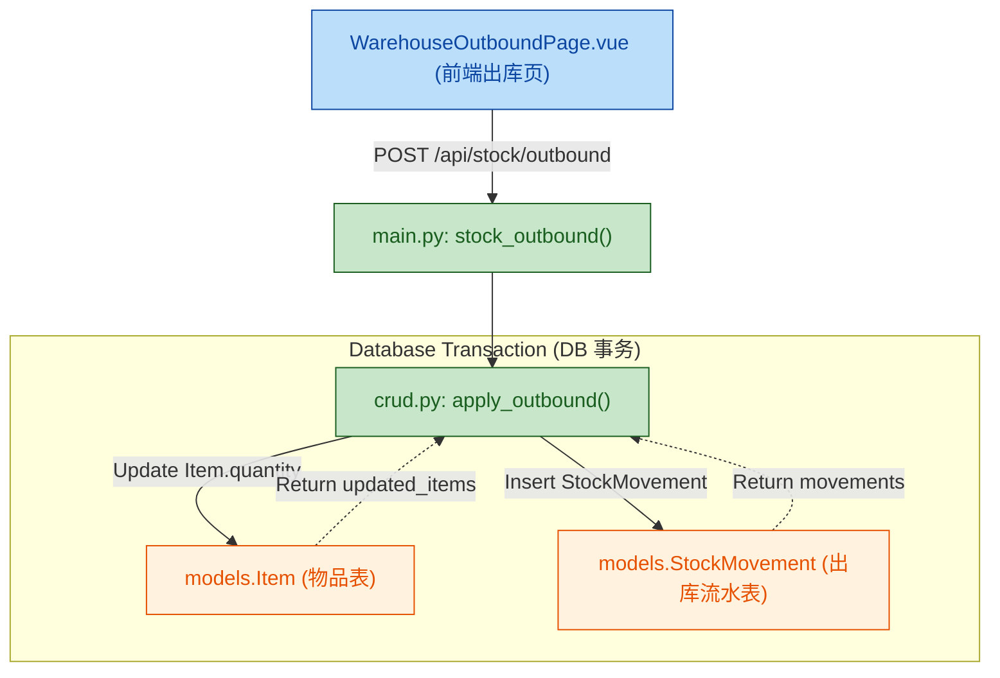

# Dashboard 出库页与删除确认 - 计划（2026-06-03）

## Summary
- Dashboard 页新增“出库”入口框，并将四宫格排序调整为：公告、出库、物品管理、数据统计。
- 新增“出库页”用于“快速出库”：文字搜索匹配多个物品、对每个物品用加减快速扣减到 0、支持一次性保存；保存后触发低库存等提醒（以现有阈值规则为准）。
- 新增后端“出库流水”能力：保存出库时记录每次扣减的流水（可追溯时间/操作者/扣减量/扣减前后数量）。
- 物品管理页删除增加二次确认，降低误删风险。
- 图片搜索：先进入待办（不在本次实现范围）。

## Current State Analysis（基于仓库现状）
### Dashboard（主页）
- 路由 `/warehouse` 指向 [WarehousePage.vue](file:///e:/PersonalFiles/Coding/Warehouse/vue/src/components/WarehousePage.vue)；其网格区域目前只渲染 3 个 grid-item（第 4 个槽位为空）。
- 现有 3 个 grid-item 依次为：
  - 公告页组件 [WarehouseNotice.vue](file:///e:/PersonalFiles/Coding/Warehouse/vue/src/components/WarehouseNotice.vue)
  - 概览组件 [DashboardSummary.vue](file:///e:/PersonalFiles/Coding/Warehouse/vue/src/components/DashboardSummary.vue)
  - 数据占位组件 [Data.vue](file:///e:/PersonalFiles/Coding/Warehouse/vue/src/components/Data.vue)
- 路由表位于 [router/index.js](file:///e:/PersonalFiles/Coding/Warehouse/vue/src/router/index.js)，当前没有“出库”相关路由。

### 库存/低库存提醒
- 库存数量与阈值字段：`Item.quantity`、`Item.min_quantity`（见 [models.py](file:///e:/PersonalFiles/Coding/Warehouse/app/models.py#L6-L47)）。
- 低库存规则目前由前端计算：`min_quantity > 0 && quantity <= min_quantity`（例如 [ItemsPage.vue](file:///e:/PersonalFiles/Coding/Warehouse/vue/src/components/ItemsPage.vue#L317-L363)）。
- 偏好开关仅存在于本地 `localStorage`（`warehouse_prefs`，见 [WarehouseUserPage.vue](file:///e:/PersonalFiles/Coding/Warehouse/vue/src/components/WarehouseUserPage.vue#L174-L200)），目前没有后端推送/通知机制。

### 物品管理删除
- 删除调用在 [ItemsPage.vue:remove](file:///e:/PersonalFiles/Coding/Warehouse/vue/src/components/ItemsPage.vue#L948-L955)，当前无二次确认，直接 `DELETE /api/items/{id}`。

## Neutral Evaluation（是否有必要 & 未考虑点）
### 是否有必要实现“出库”
- 有必要的典型场景：
  - 家庭成员经常“取用/消耗/出库”，且每次都需要快速把多个物品扣到 0 或扣减固定数量；现有“编辑数量”流程偏重、步骤多。
  - 希望对“消耗”形成可追溯记录（谁、什么时候、扣了多少、扣前扣后），以便复盘/对账/家庭协作。
- 可能不必实现的场景：
  - 出库频率低，现有在 [ItemsPage.vue](file:///e:/PersonalFiles/Coding/Warehouse/vue/src/components/ItemsPage.vue) 直接编辑 `quantity` 已满足。
  - 只关心“当前库存”，不关心“消耗过程”，则增加流水与新页面的维护成本可能不划算。

### 是否有必要新建页面实现
- 新建页面的价值：
  - 为“高频出库”提供专用交互（搜索 -> 加减 -> 批量保存），避免在编辑表单中来回切换字段。
  - 与 dashboard 四宫格模块入口一致，信息架构更清晰。
- 不新建页面也能做（备选但本次不选）：
  - 在物品管理页增加“出库模式”开关，复用现有筛选/列表；实现成本更低，但页面复杂度上升、容易让“管理”和“出库”流程互相干扰。

### 是否有必要按“搜索 + 加减到 0 + 保存”的方案实现
- 优点：
  - 非常贴合“快速消耗/取用”的手势习惯，错误成本低（在保存前可反复调整）。
  - 批量保存减少接口调用次数，并为“写入出库流水”提供天然的事务边界。
- 风险/补充点：
  - 并发与一致性：多人同时操作同一物品时，扣减基于旧数量可能产生误差，需要后端做“扣减前校验 + 事务更新”。
  - 防呆：需要避免扣成负数、避免保存空操作、保存后要能快速继续下一轮出库（重置状态）。
  - 可撤销：出库一旦保存不可撤销；未来可能需要“撤销/冲正”能力（本次先不做）。

### 是否有必要加“图片搜索”（本次进入待办）
- 在“条码/包装文本明显”的场景，图片搜索能显著降低输入成本（尤其是手机端）。
- 但它的成本与风险更高：
  - 依赖后端 OCR/LLM 的配置可用性（当前使用 ARK OCR：见 [main.py](file:///e:/PersonalFiles/Coding/Warehouse/app/main.py#L610-L624)），需要考虑无 Key、失败重试、响应时间与费用。
  - 匹配准确率不可控：图片抽取到的字段可能不稳定，需要设计“置信度 + 人工确认”的交互。
- 因此建议先把文字搜索的出库 MVP 做稳定，再把图片搜索作为增强入口（待办）。

## Decisions（本次已确认的选择）
- 出库入口：新建 `/warehouse/outbound` 页面，并在 dashboard 增加“出库”框跳转过去。
- 保存方式：实现“带出库流水”的后端能力（库存扣减与流水记录同事务提交）。
- dashboard 原“家庭仓库概览”统计：移动到“公告”框的底部展示。

## Proposed Changes（具体改动）
### 前端（Vue）
1) Dashboard 四宫格调整
- 修改 [WarehousePage.vue](file:///e:/PersonalFiles/Coding/Warehouse/vue/src/components/WarehousePage.vue)
  - 调整 `grid-container` 内渲染为 4 个 grid-item，顺序固定为：公告、出库、物品管理、数据统计。
  - “公告”框：由一个新的 dashboard 组件承载（见下一条），在底部展示“家庭仓库概览”统计（总物品/低库存/临期）。
  - “出库”框：展示模块说明 + 按钮跳转 `/warehouse/outbound`。
  - “物品管理”框：展示模块说明 + 按钮跳转 `/warehouse/items`（可额外提供“快速录入”跳转 `/warehouse/manage`）。
  - `quick-nav` 按钮区增加“出库”入口（与 dashboard 框一致）。

2) 新增 dashboard 组件（避免直接把完整页面塞进 grid-item）
- 新增 `vue/src/components/DashboardNoticeTile.vue`
  - 展示最近公告（只读预览）+ “进入公告”按钮跳转 `/warehouse/notice`。
  - 在底部嵌入统计组件（下一条）。
- 新增 `vue/src/components/DashboardStats.vue`
  - 只负责拉取 `/api/items` 并计算：总物品、低库存、临期（默认 30 天，后续可接入 `warehouse_prefs.expiringDays`）。
  - UI 复用/简化自 [DashboardSummary.vue](file:///e:/PersonalFiles/Coding/Warehouse/vue/src/components/DashboardSummary.vue) 的 cards 布局，但不包含 quick links。
  - 被 `DashboardNoticeTile.vue` 引用（满足“统计移动到公告框底部”）。

3) 新增“出库页”
- 新增 `vue/src/components/WarehouseOutboundPage.vue`（路由页）
  - 顶部：标题“出库”、返回主页按钮、可选“查看出库流水”按钮（如果本次同时提供后端查询接口）。
  - 搜索：输入框 `q`（匹配规则与 [ItemsPage.vue](file:///e:/PersonalFiles/Coding/Warehouse/vue/src/components/ItemsPage.vue#L317-L363) 一致：名称/品牌/条码/标签/备注等）。
  - 列表：渲染匹配结果（支持多条）
    - 显示：名称、当前位置/分类（可选）、当前库存、阈值（可选）、单位。
    - 出库调整：`-` / `+` 按钮调整“本次出库数量”，并显示“扣减后剩余 = max(0, 当前库存 - 本次出库)”。
    - 快捷动作：一键“扣到 0”（即本次出库 = 当前库存）。
  - 保存：
    - 仅提交本次出库数量 > 0 的条目。
    - 调用后端出库接口（见后端设计），成功后刷新物品列表并清空本次出库状态。
    - 若返回包含低库存/临期提醒数据：
      - 若 `warehouse_prefs.notifyLowStock` 开启且有低库存条目：在页面内显示醒目提示（不做系统通知）。
      - 临期提醒同理（可选，先以低库存为主，避免需求膨胀）。
  - 防呆：
    - 禁止本次出库数量为负；上限为当前库存（避免负库存）。
    - 保存前若无任何条目变化，按钮置灰。
    - 保存中禁用按钮，避免重复提交。

4) 路由注册
- 修改 [router/index.js](file:///e:/PersonalFiles/Coding/Warehouse/vue/src/router/index.js)
  - 新增 `{ path: '/warehouse/outbound', component: () => import('@/components/WarehouseOutboundPage.vue') }`。

5) 删除二次确认
- 修改 [ItemsPage.vue](file:///e:/PersonalFiles/Coding/Warehouse/vue/src/components/ItemsPage.vue#L948-L955)
  - 在 `remove(id)` 中删除请求前增加 `window.confirm` 二次确认。

### 后端（FastAPI + SQLAlchemy）
1) 新增库存出库流水表
- 修改 [models.py](file:///e:/PersonalFiles/Coding/Warehouse/app/models.py)
  - 新增 `StockMovement`（或 `InventoryMovement`）表：
    - `id`（PK）、`household_id`（索引）、`item_id`（索引）、`member_id`（索引，可空/可非空）、`action`（例如 outbound/inbound/adjust）、`delta`（负数表示出库）、`before_qty`、`after_qty`、`note`（可选）、`created_at`。
  - 依赖现有 `Base.metadata.create_all(bind=engine)`，首次启动自动创建新表（无需额外迁移工具）。

2) 新增 schema
- 修改 [schemas.py](file:///e:/PersonalFiles/Coding/Warehouse/app/schemas.py)
  - `StockMovement` 响应模型。
  - `OutboundLine`（`item_id`、`qty`、`note` 可选）。
  - `OutboundRequest`（`lines: list[OutboundLine]`）。
  - `OutboundResponse`（`updated_items`、`movements`、`warnings` 等；以实现需要为准）。

3) 新增 CRUD：事务性扣减 + 记流水
- 修改 [crud.py](file:///e:/PersonalFiles/Coding/Warehouse/app/crud.py)
  - 新增 `apply_outbound(db, household_id, member_id, lines)`：
    - 校验所有 item 均属于 household。
    - 对每个 item：
      - `before = item.quantity`
      - `deduct = min(requested_qty, before)`（避免负库存；也可选择在 requested_qty > before 时直接报错，需在实现阶段明确策略）
      - `after = before - deduct`
      - 更新 item.quantity
      - 插入 movement 记录
    - 事务边界：任何一条失败则整体回滚（保证“扣减与流水”一致）。

4) 新增 API endpoint
- 修改 [main.py](file:///e:/PersonalFiles/Coding/Warehouse/app/main.py)
  - 新增 `POST /api/stock/outbound`：
    - Depends(get_current_member) 拿到 member/household
    - 调用 `crud.apply_outbound`
    - 返回更新后的 items 与 movements（以及低库存/临期 warnings，可选）。
  - 可选：新增 `GET /api/stock/movements` 便于后续做“出库记录”页面（如果本次前端需要入口）。

## Verification（验收与自测）
### Dashboard
- 打开 `/warehouse`：
  - 四宫格顺序为：公告、出库、物品管理、数据统计。
  - 点击“出库”进入 `/warehouse/outbound`。
  - 公告框底部能看到总物品/低库存/临期统计。

### 出库页
- 搜索能匹配到多个物品。
- 对任一物品点击 `- / +`、以及“一键扣到 0”，剩余数量计算正确且不会出现负数。
- 点击“保存”后：
  - 库存被扣减（刷新后可在物品管理页看到）。
  - 后端生成对应流水（可通过接口验证；若本次实现了列表接口也可直接查看）。
  - 若扣减导致低库存，页面提示生效（至少在 UI 层可见）。

### 删除确认
- 在物品管理页点击删除时会弹出二次确认；取消不会删除；确认才删除。

## Todo（本次不做，进入待办）
- 图片搜索出库：基于 `/api/ocr/item_extract` 从图片提取关键字段（名称/品牌/条码等）后自动填入搜索框，并提供“匹配候选 + 人工确认”的交互。
- 出库流水列表页：按时间/物品筛选，支持撤销/冲正（若未来需要）。
- 条码扫码/语音输入作为更低摩擦的出库入口。

## 1. High-Level Summary (TL;DR)
*   **Impact:** **High** - 本次更新引入了核心的“快速出库与流水记录”业务闭环，重构了主页（Dashboard）的模块化结构，并补充了合规备案信息的展示。
*   **Key Changes:**
    *   ✨ **新增出库业务流：** 后端新增 `StockMovement` 表和批处理出库事务 API，前端增加独立的出库页面及快捷扣减交互。
    *   🍱 **主页架构重构：** 将原先的看板替换为四宫格结构（公告与统计、出库快捷入口、物品管理预览、数据组件）。
    *   📝 **合规性更新：** 底部增加 ICP 与公安网安备案号展示，并穿透到 Docker 构建环节。
    *   🛡️ **防误删保护：** 物品管理列表中的删除操作现已加入二次确认弹窗。
    *   🔒 **安全与网关优化：** Nginx 代理配置合并简化，并补充了 XSS 防护请求头机制。

## 2. Visual Overview (Code & Logic Map)

此流程图展示了新增的“批量出库”业务流如何贯穿前后端及数据库。

## 3. Detailed Change Analysis

### 📦 Backend: 核心出库逻辑与流水表
*   **What Changed:** 
    *   新增了 `StockMovement` 数据模型以记录物品的变更历史（包含操作前后的库存量）。
    *   在 `crud.py` 引入了具有事务保障的 `apply_outbound` 逻辑，确保扣减库存与写入流水同进退。
    *   暴露了批量出库接口和流水分页查询接口。
*   **API Endpoints:**

| Endpoint | Method | Request Payload / Params | Response / Description |
| :--- | :---: | :--- | :--- |
| `/api/stock/outbound` | `POST` | `lines: [{item_id: int, qty: int, note?: str}]` | 扣减库存并写入流水，返回受影响物品、流水明细及低库存告警 `id` 列表 |
| `/api/stock/movements` | `GET` | `skip: int, limit: int` | 获取当前家庭的历史出库记录明细 |

### 🖥️ Frontend: 页面重构与新组件
*   **What Changed:** 
    *   **主页重构：** `WarehousePage.vue` 引入了全新的模块化面板 (`.panel`) 设计，去除了旧版单一冗长的 `WarehouseNotice` 和 `DashboardSummary`，替换为 `DashboardNoticeTile`, `ItemsEmbeddedTile`, 和嵌套的 `WarehouseOutboundPage`。
    *   **快速出库体验：** `WarehouseOutboundPage.vue` 支持模糊搜索物品，通过 `+`、`-` 及“扣到 0”按钮快速编排需出库物品，并做批量保存，大大降低高频操作的摩擦。
    *   **防呆设计：** `ItemsPage.vue` 的删除方法 `remove()` 中新增了 `window.confirm`，避免点错直接导致数据丢失。

### ⚙️ Config & Infrastructure: 备案号部署与 Nginx 增强
*   **What Changed:** 
    *   增加前端环境变量以动态注入合规备案号。
    *   更新 `nginx copy.conf` 以统一管理 HTTPS 与 API 的代理规则，消除重复区块，并增加了基础的安全响应头。
*   **Config / Env Variables:**

| Key | Old Value | New Value | Description |
| :--- | :--- | :--- | :--- |
| `VUE_APP_ICP_NUMBER` | *N/A* | `(from .env)` | 用于在应用底部全局渲染的 ICP 备案号 |
| `VUE_APP_PSAP_NUMBER` | *N/A* | `(from .env)` | 用于在应用底部渲染的公安联网备案号 |
| `nginx: X-XSS-Protection` | *N/A* | `"1; mode=block"` | Nginx 代理新增的跨站脚本防御响应头 |

## 4. Impact & Risk Assessment
*   **⚠️ 破坏性变更 (Breaking Changes):** 
    *   主页 UI 组件变更：旧的概览组件已被新平铺模块取代，需确认所有相关路由跳转（如： `/warehouse/notice`）能够正常工作。
    *   Docker 构建链路改变：`Dockerfile.web` 及 `docker-compose.yml` 中注入了两个新的环境变量，必须确保构建时环境中存在对应变量或配置默认降级（目前Vue内实现了降级为空/未配置）。
*   **🧪 测试建议 (Testing Suggestions):**
    1.  **出库事务回滚测试：** 伪造一份包含合法与非法 `item_id` 的出库请求，验证事务能否全部回滚，防止产生“扣了库存但没流水”的脏数据。
    2.  **并发扣减测试：** 模拟两个端同时对同一个 `item_id` 发起出库请求，观察库存计算是否出现并发异常（如扣减成负数）。
    3.  **二次确认验证：** 验证在“物品管理”页面点击删除后点击“取消”，数据不被删除。